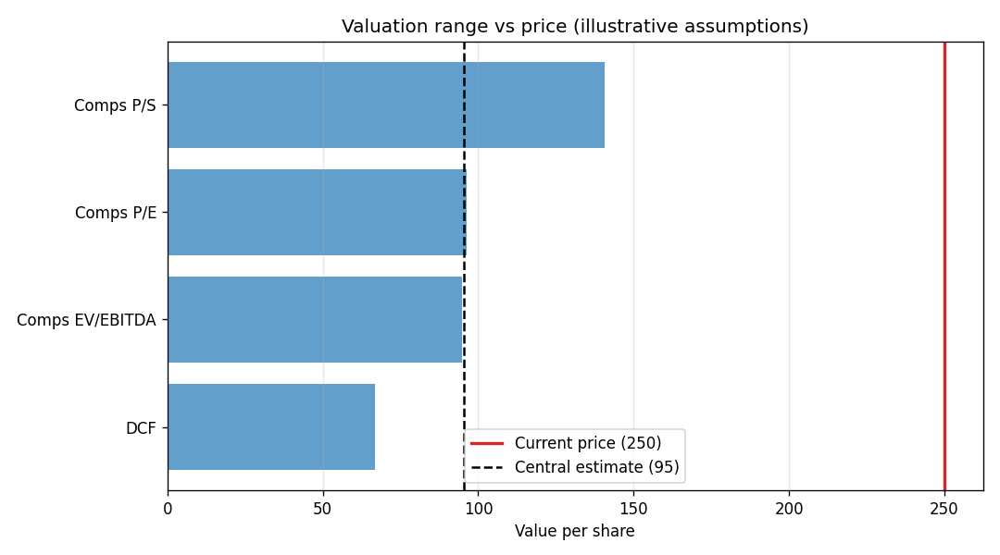
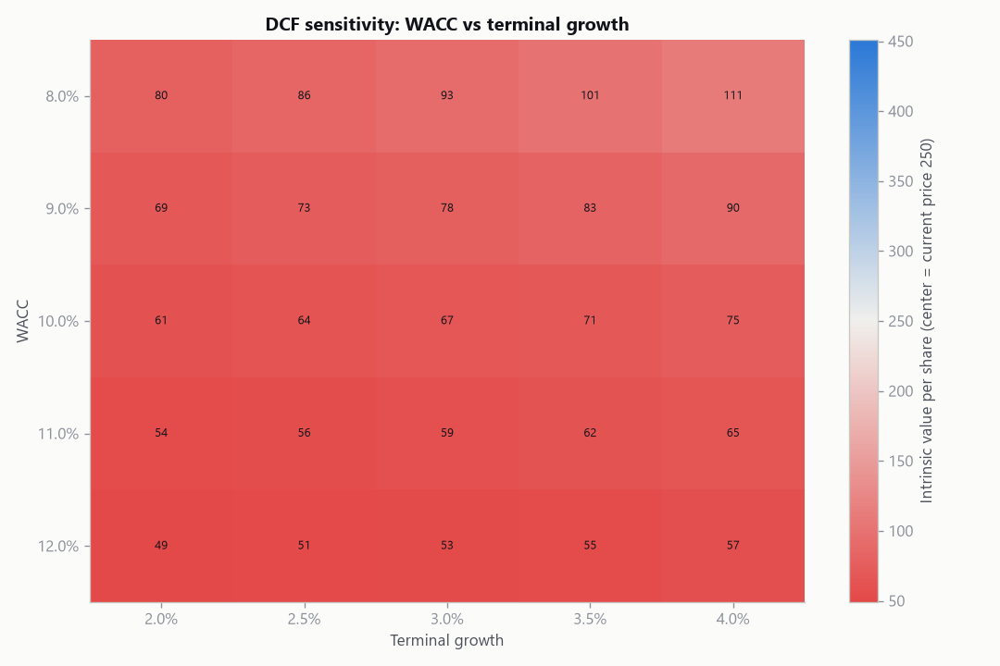

# Stock Valuation (DCF + Comparables)

Two independent ways to put a number on a company, run side by side: a
discounted cash flow model built from scratch, and a comparables valuation using
peer multiples. The output is not a single price target but a range, plus a
clear view of where today's market price sits inside it.

Everything runs from assumptions you supply in `config.yaml`. The valuation is
only ever as good as those assumptions, which is the honest point of the whole
exercise.

## Example output

From the bundled illustrative assumptions (`python scripts/value_company.py
--save-plots`). The numbers are round demonstration figures, not a real
company.

```
Per-share estimates by method:
  DCF               66.83
  Comps EV/EBITDA   94.69
  Comps P/E         96.25
  Comps P/S        140.62

Range: 66.83 to 140.62
Central estimate: 95.47
Implied upside vs price: -61.8%
Recommendation: Overvalued: the central estimate sits below the price (lean avoid).

DCF note: 75% of enterprise value is the terminal value.
```

The football-field chart shows each method's value against the current price,
and the sensitivity heatmap shows how the DCF swings with its two most fragile
inputs:

| Valuation range vs price | DCF sensitivity |
|--------------------------|-----------------|
|  |  |

That "75% of value is terminal value" line is the single most important caveat
in any DCF, and the model reports it on every run.

## How a DCF works here

1. Project free cash flow forward using per-year growth assumptions.
2. Discount each year back to today at the weighted average cost of capital.
3. Capture everything beyond the projection window in a Gordon-growth terminal
   value, and discount that back too.
4. Sum to enterprise value, subtract net debt for equity value, divide by shares
   for an intrinsic value per share.

```
TerminalValue = FCF_final * (1 + g) / (WACC - g)
```

The model refuses to run if WACC is not greater than the terminal growth rate,
because that makes the terminal value infinite and the answer meaningless.

## How the comparables work

Peer multiples are applied to the company's own metrics. The multiples attach to
value at different points in the capital structure, which the code handles:

- **EV / EBITDA** gives an enterprise value, so net debt is subtracted to reach
  equity.
- **P / E** and **P / S** give equity value directly.

## Why both

A DCF is rigorous but assumption-heavy, and most of its answer hides in the
terminal value. Comparables are anchored to real market prices but only as good
as the peer set. Run together, they triangulate. When they disagree sharply, as
in the example above, that gap is itself the finding, and it usually points back
to an aggressive growth or discount-rate assumption in the DCF.

## How it works

| Module           | Responsibility                                          |
|------------------|---------------------------------------------------------|
| `dcf.py`         | Project, discount, terminal value, enterprise to per share |
| `comparables.py` | Apply peer multiples to the target's metrics            |
| `sensitivity.py` | Sweep WACC and terminal growth into a value grid        |
| `valuation.py`   | Combine both methods into a range and a recommendation  |
| `plotting.py`    | Cash flow, sensitivity heatmap, and football-field charts |

## Getting started

```bash
git clone https://github.com/KelsonLam/stock-valuation.git
cd stock-valuation
pip install -r requirements.txt
python scripts/value_company.py --save-plots
```

Edit `config.yaml` with your own company's cash flow, growth, WACC, net debt,
shares, peer multiples, and current price.

## Being honest about the limits

- **Garbage in, garbage out.** A DCF is an assumption amplifier. Small changes in
  WACC or terminal growth move the answer a lot, which is exactly why the
  sensitivity grid ships alongside the point estimate.
- **The terminal value dominates.** When most of the value sits past the
  forecast window, you are really betting on a perpetual growth rate, not on the
  cash flows you actually projected.
- **Comparables need a real peer set.** The quality of a multiples valuation is
  the quality of the peers and the comparability of their accounting. The
  example multiples here are placeholders.
- **This is not investment advice.** The recommendation is a mechanical
  comparison of an assumption-driven estimate against a price, nothing more.

## Tests

```bash
pip install pytest
pytest
```

The suite checks FCF compounding, a fully hand-computed DCF case, that the model
rejects WACC below terminal growth, that a higher discount rate lowers value,
the comparables formulas, the sensitivity grid shape and its invalid-cell
handling, and the recommendation logic.

## Project layout

```
stock-valuation/
├── config.yaml
├── requirements.txt
├── scripts/
│   └── value_company.py
├── src/valuation/
│   ├── dcf.py
│   ├── comparables.py
│   ├── sensitivity.py
│   ├── valuation.py
│   └── plotting.py
└── tests/
    └── test_valuation.py
```

## License

MIT. See [LICENSE](LICENSE).
